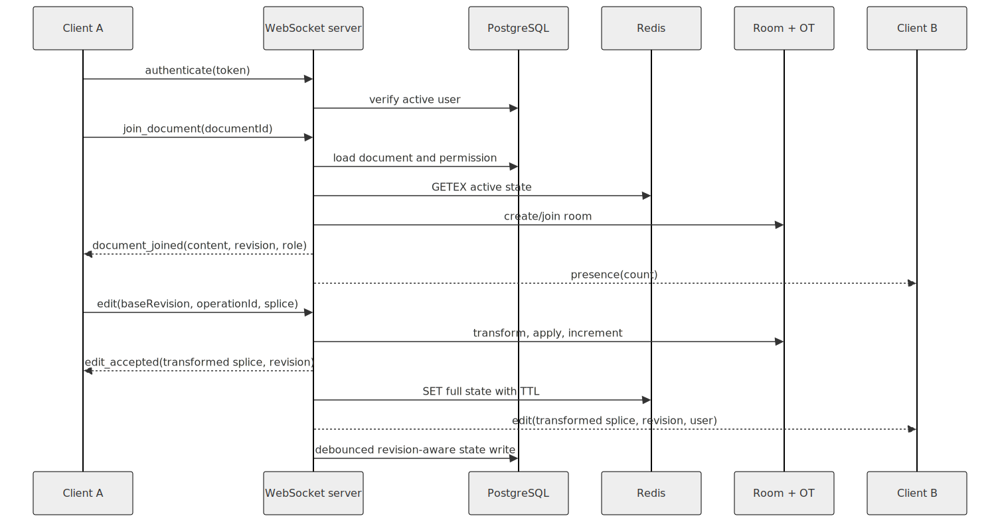

# Collaborative Text Editor

A full-stack collaborative rich-text editor for small teams. Authenticated users can create and share documents, edit them together over WebSockets, and recover accepted content through Redis-backed active state and revision-aware PostgreSQL persistence.

This repository contains a React browser client, a Node.js HTTP/WebSocket server, one PostgreSQL schema, and local PostgreSQL/Redis infrastructure. The implementation is intentionally compact: the Express API gateway, domain modules, collaboration engine, and persistence coordinator run in one backend process.

## Project overview

The application provides a shared writing workspace for registered users. Owners can create, share, and archive documents; editors can change shared content; viewers can follow live changes without modifying the document. A server-authoritative revision and operational-transform (OT) pipeline orders concurrent edits and distributes the accepted result to every active participant.

The editor stores sanitized rich-text HTML. Collaboration operations are string splices over that serialized HTML, expressed as an index, deletion length, and inserted text.

## Features

- **Authentication and accounts:** registration, login, session validation, and password-confirmed profile updates. Passwords use Node.js `scrypt`; session tokens are HS256 JWTs with configurable expiry.
- **Document management:** authenticated create, list, read, title/content/metadata update, explicit save, and soft archive operations.
- **Sharing and permissions:** owner, editor, and viewer roles; direct invitations by account email; 12-character role-scoped share codes; owner-only member lists and archiving.
- **Live collaboration:** an authenticated `/ws` endpoint, document rooms, participant counts, edit acknowledgements, and broadcasts to other room members.
- **Operational transform:** revision-based transformation of stale string splices, deterministic server-arrival ordering, bounded history, range validation, and idempotent operation IDs.
- **Automatic persistence:** accepted live edits schedule debounced PostgreSQL writes. Newer pending revisions replace older pending writes, failed writes are retried, inactive rooms flush immediately, and shutdown drains all pending state.
- **Redis active-state cache:** versioned JSON records hold content, revision, and last editor with a sliding TTL. Invalid records are removed; misses and stale entries are repopulated from PostgreSQL.
- **Recovery:** Redis state at or ahead of PostgreSQL can initialize a new room and repair the durable record. Revision guards prevent an older persistence task from overwriting a newer database version.
- **Responsive editor UI:** rich-text formatting, document navigation, sharing and account dialogs, live version/save state, read-only viewer rendering, and persistent light/dark themes.
- **Health and error handling:** process and dependency health endpoints, request validation, consistent HTTP status mapping, WebSocket protocol errors, authentication timeouts, heartbeat termination, and cache failure degradation.

There is no external message broker. WebSocket messages are serialized per connection with a Promise chain, and database work is coalesced by an in-process persistence scheduler.

## Technology stack

| Area | Implementation |
| --- | --- |
| Frontend | React 19, TypeScript 5.9, Vite 7, browser Fetch and WebSocket APIs |
| Backend | Node.js CommonJS, Express 5, `ws` 8 |
| Authentication | Node.js `crypto` (`scrypt`, HMAC SHA-256), custom JWT encoding/verification |
| Database | PostgreSQL 16, `pg`, SQL migrations, `pgcrypto`, `citext` |
| Realtime | WebSockets, in-memory rooms, revisioned OT |
| Caching | Redis 7, `redis` client, expiring JSON records |
| Local infrastructure | Docker Compose with persistent PostgreSQL and Redis volumes |
| Development | npm, Vite proxy, TypeScript project references, ESLint 9 |
| Testing | Node.js strict assertions, HTTP lifecycle tests, WebSocket integration tests, in-memory test doubles |

## System architecture



[Mermaid source](docs/diagrams/system-architecture.mmd)

The HTTP gateway and WebSocket upgrade path are separate. HTTP routes handle accounts, document lifecycle, and sharing. Live edits enter through `/ws`, pass through room permission checks and OT, then update Redis, schedule PostgreSQL persistence, and broadcast the accepted operation.

See [WORKFLOW.md](WORKFLOW.md) for component contracts, detailed sequences, consistency rules, and failure behavior. Static architecture and test counts are recorded in [METRICS.md](METRICS.md).

## Folder structure

```text
.
|-- backend/
|   |-- server.js                 # HTTP/WebSocket process entry point
|   |-- src/
|   |   |-- config/               # Environment, PostgreSQL, and Redis clients
|   |   |-- db/                   # Migration runner and SQL schema
|   |   |-- http/                 # Express app and /api gateway
|   |   |-- modules/
|   |   |   |-- auth/             # Accounts, passwords, JWTs, middleware
|   |   |   |-- collaboration/    # Protocol, rooms, WebSocket server, Redis cache
|   |   |   |-- documents/        # CRUD, permissions, sharing, persistence
|   |   |   `-- operations/       # Operational transform engine
|   |   `-- queue/                # Documents the intentionally absent broker layer
|   `-- package.json
|-- docs/
|   `-- diagrams/                  # Rendered SVGs with editable Mermaid sources
|-- frontend/
|   |-- src/
|   |   |-- App.tsx               # Workspace, dialogs, and synchronization state
|   |   |-- api.ts                # Typed HTTP helper and API models
|   |   `-- collaboration/        # Typed WebSocket client
|   |-- vite.config.ts
|   `-- package.json
|-- docker-compose.yml            # PostgreSQL and Redis development services
|-- WORKFLOW.md                    # Internal architecture and execution flows
`-- METRICS.md                     # Measured implementation and verification counts
```

Detailed folder guides begin at [backend/README.md](backend/README.md) and [frontend/README.md](frontend/README.md).

## Request lifecycles

### HTTP request

1. The React client calls `/api/*` with an optional bearer token.
2. Express applies CORS and the 1 MiB JSON body limit.
3. The API gateway routes the request to authentication or documents.
4. Protected routes verify the JWT and reload the active user from PostgreSQL.
5. The domain repository runs parameterized SQL, with transactions for multi-table changes.
6. Module error middleware maps validation, permission, conflict, and not-found errors; the app handler hides unexpected server details.

### Live edit

1. The client authenticates the WebSocket and joins an authorized document room.
2. PostgreSQL establishes access; Redis may supply newer active content for a newly created room.
3. The browser computes one splice against its acknowledged revision and sends it with a unique operation ID.
4. The room's OT state transforms the splice through any newer retained operations, applies it, and increments the revision.
5. The server acknowledges the sender, schedules a debounced PostgreSQL write, and writes the full accepted state to Redis.
6. The transformed operation is broadcast to the other room members. The frontend applies only contiguous revisions and rejoins if it detects a gap or invalid range.

## Collaboration workflow



[Mermaid source](docs/diagrams/collaboration-workflow.mmd)

One `DocumentOperationState` exists per active room. Its 1,000-entry history is deliberately ephemeral; Redis and PostgreSQL retain the latest full state, not the operation log.

## Database overview

| Table | Purpose and relationships |
| --- | --- |
| `schema_migrations` | Created by the migration runner. Records migration ID, filename, SHA-256 checksum, and application time. |
| `users` | Stores case-insensitive email, display name, password hash, JSON metadata, timestamps, and optional soft-deletion time. |
| `documents` | Stores owner, title, serialized rich-text content, monotonic version, JSON metadata, timestamps, and optional archive time. The owner references `users`. |
| `document_permissions` | Many-to-many document/user access with `owner`, `editor`, or `viewer` role and an optional granting user. The composite primary key prevents duplicate memberships. |
| `document_metadata` | One-to-one document statistics: character count, word count, last editor, and last edit time. |

The initial migration also creates two PostgreSQL extensions, nine application indexes, four `updated_at` triggers, JSON-object checks, non-negative count/version checks, and foreign-key delete rules. Share-code data currently lives inside `documents.metadata`; repository responses remove that private field before returning normal document metadata.

## Redis overview

Each active document uses key `collab:active-document:<documentId>`. The value is JSON:

```json
{
  "schemaVersion": 2,
  "documentId": "<uuid>",
  "content": "<serialized rich text>",
  "revision": 12,
  "lastEditedByUserId": "<uuid-or-null>",
  "cachedAt": "<ISO-8601 timestamp>"
}
```

- `SET ... EX` assigns the configured TTL; `GETEX ... EX` refreshes it on reads, producing a sliding expiration window.
- A missing, malformed, schema-incompatible, or mismatched record is treated as a miss; malformed records are deleted.
- PostgreSQL authorization always runs before the cache is read, so Redis never grants access.
- A cache revision older than PostgreSQL is ignored and replaced. A cache revision at or ahead of PostgreSQL is used; ahead or divergent equal-version content schedules database repair.
- Redis failures are logged and live collaboration continues from the room or PostgreSQL. Redis is therefore a recovery/performance layer, not the permission authority.

## Running locally

### 1. Install dependencies

```bash
cd backend
npm install
cd ../frontend
npm install
```

### 2. Start PostgreSQL and Redis

```bash
docker compose up -d postgres redis
```

### 3. Configure and migrate the backend

Copy `backend/.env.example` to `backend/.env`, change secrets as appropriate, then run:

```bash
cd backend
npm run migrate
npm run dev
```

Backend variables:

| Variable | Default/purpose |
| --- | --- |
| `NODE_ENV` | `development`; production requires an explicit JWT secret. |
| `PORT` | `5000` |
| `CORS_ORIGIN` | `http://localhost:5173` |
| `DATABASE_URL` | PostgreSQL connection string |
| `REDIS_URL` | Redis connection URL |
| `ACTIVE_DOCUMENT_CACHE_TTL_SECONDS` | `86400`; sliding cache TTL |
| `DOCUMENT_PERSIST_DEBOUNCE_MS` | `1000`; live-state coalescing delay |
| `DOCUMENT_PERSIST_RETRY_MS` | `5000`; retry delay after a failed write |
| `JWT_SECRET` | HS256 signing secret; mandatory in production |
| `JWT_EXPIRES_IN_SECONDS` | `3600` |

### 4. Start the frontend

```bash
cd frontend
npm run dev
```

Vite proxies `/api` and `/ws` to port 5000. For separate deployments, configure `VITE_API_BASE_URL` and `VITE_WEBSOCKET_URL` from `frontend/.env.example`.

### Production build and process

```bash
cd frontend
npm run build

cd ../backend
npm run migrate
npm start
```

The backend does not serve `frontend/dist`; deploy that static output through a web server or hosting platform and route its API/WebSocket settings to the backend. Terminate TLS upstream and use `wss://` for the production WebSocket URL.

## API overview

All `/api/documents` routes require `Authorization: Bearer <token>`.

### Service and health

| Method | Path | Behavior |
| --- | --- | --- |
| `GET` | `/` | Basic service status |
| `GET` | `/health` | Process environment and uptime |
| `GET` | `/health/dependencies` | Concurrent PostgreSQL and Redis probes; returns 503 if either fails |
| `GET` | `/api` | API route index |

### Authentication

| Method | Path | Behavior |
| --- | --- | --- |
| `POST` | `/api/auth/register` | Create an account and issue a session token |
| `POST` | `/api/auth/login` | Verify credentials and issue a session token |
| `GET` | `/api/auth/session` | Validate the token and return the active user |
| `GET` | `/api/auth/me` | Return the authenticated user |
| `PATCH` | `/api/auth/me` | Update name, email, and/or password after current-password verification |

### Documents and sharing

| Method | Path | Required role | Behavior |
| --- | --- | --- | --- |
| `GET` | `/api/documents` | Any member | List accessible, non-archived documents |
| `POST` | `/api/documents` | Authenticated user | Create a document and owner membership |
| `POST` | `/api/documents/join` | Authenticated user | Redeem a share code |
| `GET` | `/api/documents/:documentId` | Any member | Read one active document |
| `GET` | `/api/documents/:documentId/members` | Owner | List active members |
| `POST` | `/api/documents/:documentId/share` | Owner | Add/update a member by email |
| `POST` | `/api/documents/:documentId/share-link` | Owner | Replace the document's role-scoped share code |
| `PATCH` | `/api/documents/:documentId` | Owner/editor | Update supplied title, content, and/or metadata fields |
| `PUT` | `/api/documents/:documentId/save` | Owner/editor | Save content through the HTTP path |
| `DELETE` | `/api/documents/:documentId` | Owner | Soft archive and advance the version |

### WebSocket

Connect to `WS /ws`, then send `authenticate`, `join_document`, `leave_document`, and `edit` JSON messages. Server messages are `connected`, `authenticated`, `document_joined`, `document_left`, `presence`, `edit_accepted`, `edit`, and `error`. The full protocol is in [backend/src/modules/collaboration/README.md](backend/src/modules/collaboration/README.md).

## Verification

```bash
cd backend
npm run check
npm test

cd ../frontend
npm run lint
npm run build
```

Database-backed CRUD and access tests use the configured PostgreSQL database and run migrations. Other backend tests isolate OT, Redis cache behavior, persistence scheduling, and WebSocket collaboration with test doubles.

## Future improvements

- Split the large frontend workspace into focused components and hooks while preserving the current synchronization boundary.
- Add refresh-token/session revocation support and HTTP/WebSocket rate limiting for internet-facing deployments.
- Replace in-memory rooms with a multi-instance collaboration topology using shared routing/pub-sub and a single-writer or partitioning strategy per document.
- Use compare-and-set semantics for Redis writes if multiple collaboration processes can update the same document.
- Persist an operation log or periodic snapshots when audit history or long-lived offline editing becomes a product requirement.
- Add structured logging, request correlation, latency/error metrics, and distributed traces.
- Add browser-level automated tests for rich-text selection, formatting, reconnect, and accessibility flows.

## Documentation map

- [Internal workflow](WORKFLOW.md)
- [Architecture metrics](METRICS.md)
- [Diagram assets and regeneration](docs/diagrams/README.md)
- [Backend guide](backend/README.md)
- [Backend source map](backend/src/README.md)
- [Frontend guide](frontend/README.md)
- [Frontend source map](frontend/src/README.md)
