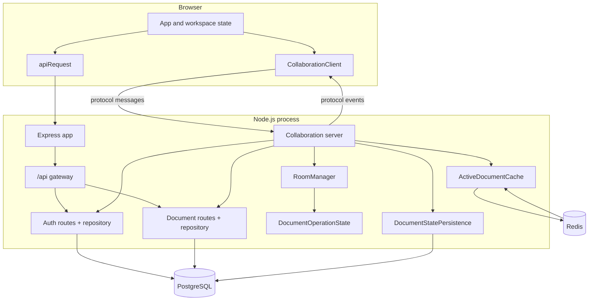
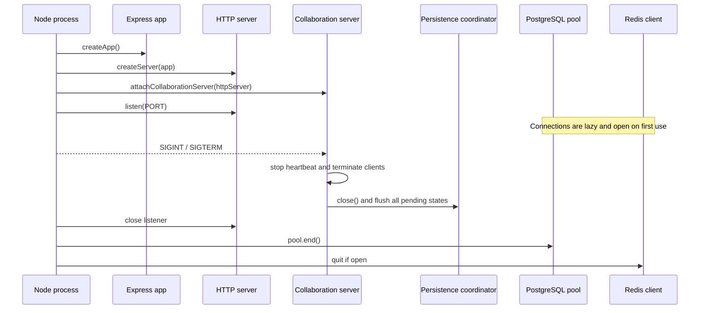
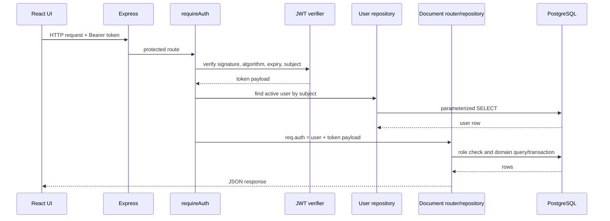
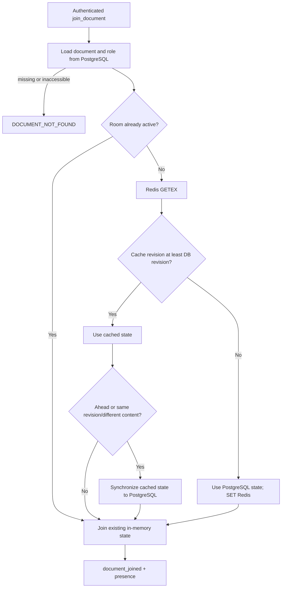
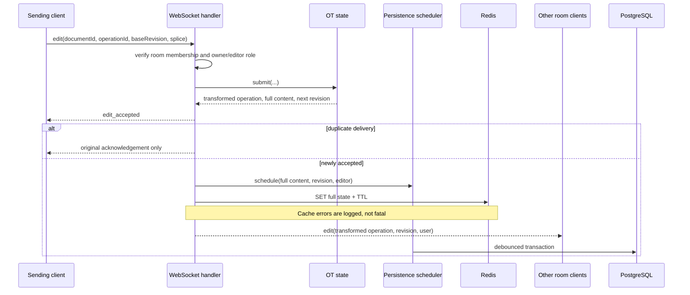
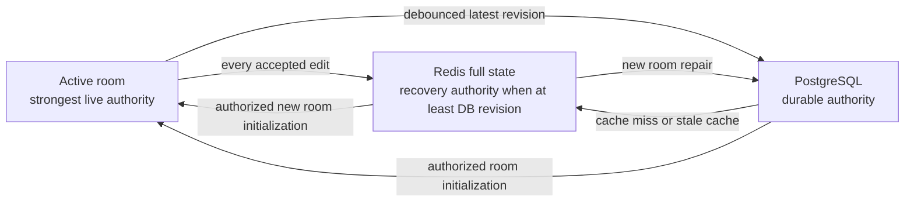

# Collaborative Text Editor Engineering Workflow

This document describes the implemented runtime as an interconnected system. It is based on the current source and tests; it does not describe planned services.

## High-level architecture

The application is a single backend process plus a separately served browser bundle. The backend owns two ingress paths:

- Express handles HTTP health, account, and document requests.
- A `ws` server handles HTTP upgrades only at `/ws` and owns the realtime protocol.

Both paths use the same authentication and document repositories. PostgreSQL is the durable account, permission, and document authority. Redis stores the latest active collaboration state so a room can be recreated without losing accepted edits that have not yet reached PostgreSQL. In-memory rooms own the authoritative state only while participants are connected.



## Component responsibilities

| Component | Inputs | Outputs | Dependencies | Failure handling | Performance/scaling notes |
| --- | --- | --- | --- | --- | --- |
| Frontend `App` | User actions, HTTP responses, WebSocket messages | Rendered workspace, HTTP requests, splice operations | `apiRequest`, `CollaborationClient`, browser DOM/storage | Displays API/protocol errors; rejoins on revision gaps; rolls optimistic content back on send failure | Allows one unacknowledged local operation, limiting client-side rebase complexity |
| HTTP API gateway | `/api/*` requests | Auth/document router responses or JSON 404 | Express routers | Defers module errors; unknown API paths return 404 | In-process router, not a separate proxy/service |
| Authentication | Credentials, bearer tokens, profile changes | Users and signed session tokens | PostgreSQL, Node crypto, environment | Validation 400, duplicate email 409, invalid auth 401; production refuses missing JWT secret | `scrypt` is intentionally CPU/memory costly; user is reloaded on protected requests |
| Documents | Authenticated CRUD/sharing inputs | Document and member DTOs | PostgreSQL, auth middleware | Transactions roll back; role errors map to 403; inaccessible/missing documents are hidden as 404 | Parameterized queries and indexed permission/recency lookups |
| WebSocket collaboration | Protocol JSON frames | Acknowledgements, presence, transformed edits, errors | Auth/doc repositories, rooms, cache, persistence | Per-client queue catches failures; auth timeout; heartbeat; protocol-specific error codes | In-memory room ownership binds a document to one process in the current deployment |
| Room manager | Authorized client and document DTO | Membership, participant count, room OT state, broadcasts | `ws`, operations module | Closed sockets are skipped; empty rooms are removed | Map lookups are constant-time; broadcast work is linear in room members |
| Operational transform | Base revision and string splice | Accepted transformed splice, content, next revision | None | Rejects future/expired revisions, invalid ranges, reused IDs | Retains at most 1,000 operations/idempotency entries per active room |
| Redis cache | Document ID and full state | Cached content/revision/last editor | Redis client, TTL config | Invalid values deleted; caller catches unavailability and falls back | Full document is serialized per accepted edit; sliding TTL refreshes reads |
| Persistence coordinator | Accepted full states | Coalesced repository writes | Timer API, document repository | Failed state remains pending and gets a retry timer; close uses all-settled | One record/timer per dirty document; rapid edits collapse to the newest revision |
| PostgreSQL repository | Account, access, and document operations | Durable rows and DTOs | `pg` pool | Multi-row changes are transactional; stale realtime writes return without overwrite | Row lock serializes writes to a document; indexes support active email, ownership, permission, recency, and JSON lookup |
| Migration runner | Ordered SQL files | Applied/skipped counts and migration records | File system, PostgreSQL, SHA-256 | Rejects invalid/duplicate filenames and altered applied checksums; each migration is transactional | Loads all migrations at startup of the command; migrations are not run by normal server startup |
| Configuration | Process environment | Frozen-by-convention `env` object and lazy clients | `dotenv`, `pg`, `redis` | Invalid positive integers fall back; production requires `JWT_SECRET`; client errors are logged | Redis connection attempts share one in-flight Promise; PostgreSQL uses a pool |

## Startup and shutdown

`backend/server.js` creates the Express app, wraps it in a Node HTTP server, attaches the no-server WebSocket implementation, and starts listening. It does not run migrations automatically.



The server waits for collaboration shutdown before closing the HTTP listener. Once the listener closes, PostgreSQL and Redis shutdown run concurrently with `Promise.allSettled`.

## HTTP routing and request flow

### Application middleware

`createApp()` installs:

1. CORS for exactly `CORS_ORIGIN`, with credentials enabled.
2. JSON parsing with a 1 MiB body limit.
3. service and health routes.
4. the `/api` gateway.
5. the final unexpected-error handler.

The API gateway mounts authentication at `/api/auth` and documents at `/api/documents`, then returns a JSON 404 for unrecognized API routes. There is no global 404 after `/api`; non-API unknown paths therefore use Express's default behavior.

### Protected request sequence



Reloading the user means a valid token for a deleted/nonexistent user is rejected. The token's email/display-name claims are not used as the current account record.

## Authentication workflow

Registration normalizes email to lowercase, trims the display name, enforces minimum name/password requirements, hashes the password with a random 16-byte salt and explicit `scrypt` parameters, and inserts the user. PostgreSQL's partial unique index enforces uniqueness only for active users.

Login loads the password hash by normalized email and compares the derived key with `timingSafeEqual`. A successful registration/login signs a compact HS256 JWT containing `sub`, email, display name, issued-at, and expiry claims. The custom verifier requires three segments, checks `alg`/`typ`, compares signatures safely, validates expiry, and requires a string subject.

Profile updates require a current password even when only the display name or email changes. The repository builds only the requested SQL assignments. Changing an email can surface the same active-email conflict as registration.

Related: [authentication module](backend/src/modules/auth/README.md), [configuration](backend/src/config/README.md), [database](backend/src/db/README.md).

## Document CRUD, sharing, and permissions

The document router applies `requireAuth` to every route. Validation occurs before repository calls.

### Permission model

| Role | Read/list | Edit title/content/metadata | Publish live edits | List/invite members | Create share code | Archive |
| --- | --- | --- | --- | --- | --- | --- |
| Owner | Yes | Yes | Yes | Yes | Yes | Yes |
| Editor | Yes | Yes | Yes | No | No | No |
| Viewer | Yes | No | No | No | No | No |

Creating a document is a transaction across `documents`, the owner row in `document_permissions`, and `document_metadata`. Content updates increment `documents.version` and upsert text statistics. Title-only and metadata-only HTTP updates do not advance the version because the collaboration revision tracks content changes.

Deletion is a soft archive (`archived_at`) plus a version increment. Normal document queries filter archived records. A missing permission is deliberately returned as not found, while a known member with an insufficient role receives a permission error.

Direct sharing resolves an active user by email and upserts a non-owner permission. Creating a share code writes `{code, role}` into the document's JSON metadata. Redeeming the code locks the document row, grants/updates the caller's non-owner permission, and returns the document. Share codes have no separate expiry timestamp or revocation endpoint; generating a later code replaces the metadata value.

Related: [documents module](backend/src/modules/documents/README.md), [HTTP layer](backend/src/http/README.md), [database](backend/src/db/README.md).

## Realtime connection workflow

### Connection and authentication

The WebSocket server accepts upgrades only when the URL path is exactly `/ws`; other upgrade paths receive 404 and the socket is destroyed. Frames are limited to 64 KiB and binary messages are rejected.

On connection, the server sends `connected`, starts a 10-second authentication timer, and creates a Promise chain for that client's messages. Chaining prevents asynchronous messages from the same socket from racing one another. JWT verification uses the same token module as HTTP, and the user is reloaded from PostgreSQL. Failed or timed-out authentication closes with policy status 1008.

A 30-second heartbeat marks each client inactive, sends a ping, and terminates clients that did not answer the previous ping.

### Room join and cache selection



PostgreSQL is queried even when a room already exists, so current membership is checked on every join. Once a room exists, its OT state is authoritative and cache/database state is not reread for later members.

Redis failure during join logs a warning and returns the database state. Cache-repair failure also logs a warning; the room can still use the valid cached state.

## Operational transform

An edit operation is:

```ts
{ index: number; deleteCount: number; insertText: string }
```

Indices and lengths follow JavaScript string semantics (UTF-16 code units). The protocol accepts inserted text up to 50,000 characters and client operation IDs up to 128 characters. A no-op splice is rejected.

`DocumentOperationState.submit()` performs these steps:

1. Build an idempotency key from user ID and client operation ID.
2. Return the original result for an exact duplicate, or reject reuse with different input.
3. Reject negative, future, or older-than-retained base revisions.
4. Select accepted operations newer than the submitted base revision.
5. Derive the historical base content length by reversing those operations' length deltas, then validate the submitted range.
6. Transform the submitted operation through newer operations in server acceptance order.
7. Validate and apply the transformed operation to current content.
8. Increment the revision, record history/idempotency state, and trim both to the 1,000-entry limit.

Position transformation uses left/right affinity at boundaries. This makes concurrent same-position inserts follow server arrival order and gives delete endpoints deterministic behavior around inserted text. Overlapping delete spans shrink to the remaining live interval.

The frontend does not implement a second OT engine. It permits one optimistic local splice, waits for `edit_accepted`, and applies the server's transformed operation to its authoritative content reference. Remote edits and acknowledgements must advance exactly one revision. A gap, invalid application, stale revision error, or unexpected acknowledgement triggers leave/rejoin synchronization.

Related: [operations module](backend/src/modules/operations/README.md), [collaboration module](backend/src/modules/collaboration/README.md), [frontend source](frontend/src/README.md).

## Accepted edit flow



The Redis write is awaited before peer broadcast. PostgreSQL persistence is scheduled before Redis and executes later unless explicitly flushed. The sender receives its acknowledgement before the cache write. This ordering minimizes acknowledgement latency but means an abrupt process failure can occur between acceptance and external persistence; orderly room closure and shutdown explicitly flush pending database state.

## Redis caching

`ActiveDocumentCache` owns the `collab:active-document:` namespace and schema version 2. It validates document ID inputs and state shapes before access.

- `get()` uses `GETEX`, refreshing the TTL on a hit.
- `set()` writes the full state and expiry, including a diagnostic `cachedAt` timestamp.
- `delete()` is available to callers, though the current application does not call it during archive or normal room removal.
- Parse failures, wrong schema versions, mismatched document IDs, invalid revisions, and invalid last-editor values cause deletion and a cache miss.

Because every accepted edit writes full content, Redis cost grows with document size rather than operation size. The current design favors simple recovery over incremental cache encoding.

Related: [collaboration module](backend/src/modules/collaboration/README.md), [configuration](backend/src/config/README.md).

## PostgreSQL persistence and synchronization

`DocumentStatePersistence` keeps one record per dirty document:

```text
documentId -> latestRevision, pendingState, timer, flushPromise
```

Scheduling ignores revisions older than the newest observed revision and replaces pending state with the latest. Only one flush Promise runs per document. `drain()` continues if a newer state arrives while a write is in flight. On failure it restores the failed state unless an even newer pending state exists; the completion handler installs a retry timer.

`writeDocumentState()` starts a transaction and locks the document row with `FOR UPDATE`. It rejects missing/archived documents, returns `stale` when PostgreSQL is newer, returns `unchanged` when revision and content already match, otherwise updates full content/version and upserts statistics before commit.

This creates a latest-revision-wins rule for delayed work while still serializing concurrent database writers. It does not coordinate an HTTP content update with an already active room; the expected UI content path during live editing is WebSocket collaboration.

Flush triggers are:

- the normal debounce timer;
- retry timer after a failed write;
- the final participant leaving a room;
- WebSocket server shutdown.

Related: [documents module](backend/src/modules/documents/README.md), [database](backend/src/db/README.md), [queue note](backend/src/queue/README.md).

## Database design and migrations

The migration runner reads filenames matching `NNN_description.sql`, computes SHA-256 checksums, sorts by numeric ID, and rejects duplicate IDs/names. It creates `schema_migrations` before comparing known migrations. Reusing an ID/name inconsistently or changing an already-applied file fails rather than silently drifting.

Each new migration and its tracking row execute in one transaction. The application currently has one migration defining `users`, `documents`, `document_permissions`, `document_metadata`, indexes, constraints, extensions, and `updated_at` triggers.

Run `npm run migrate` before starting a new database. Normal `npm start` does not apply schema changes.

## Frontend state and editor synchronization

The frontend is concentrated in `App.tsx`:

- `App` restores theme/session state from `localStorage` and switches between loading, auth, and workspace screens.
- `Workspace` loads documents over HTTP, owns selection/editor/dialog state, and owns one `CollaborationClient` per session token.
- Refs hold values needed across asynchronous WebSocket callbacks: active/requested document IDs, authoritative content, server revision, and the one pending operation ID.
- `handleCollaborationMessage` applies join, presence, edit, acknowledgement, and error transitions.
- Dialog components handle invitations, share codes, joining, and password-confirmed profile changes.

The contenteditable surface is sanitized to an allowlist of structural/formatting elements. All attributes are stripped except normalized `text-align` styles. Paste is forced to plain text. Formatting uses browser `execCommand`, sanitizes the resulting HTML, then routes the change through the same splice generator.

`createEditOperation()` finds the common prefix and suffix between prior and next HTML, producing one replacement splice. While that splice is pending, editing controls and the contenteditable surface are disabled. The footer derives word/character counts from rendered text rather than raw HTML.

The frontend stores the bearer token and theme in `localStorage`; it does not store document content locally. `apiRequest()` centralizes base URL resolution, JSON/bearer headers, 204 handling, and API error extraction.

Related: [frontend guide](frontend/README.md), [frontend source](frontend/src/README.md), [WebSocket client](frontend/src/collaboration/README.md).

## Background queue status

No external queue, worker process, Redis pub/sub channel, or job table is implemented. Two constructs use queue-like ordering:

- each WebSocket client has a Promise chain named `messageQueue`, which serializes that client's asynchronous frames;
- `DocumentStatePersistence` holds per-document pending state and timers in process memory.

Neither construct survives an ungraceful process exit. Redis full-state writes provide the recovery window for accepted edits, while PostgreSQL is the durable destination. See [backend/src/queue/README.md](backend/src/queue/README.md).

## Error handling and logging

### HTTP

- Validation modules return field-level 400 details.
- Authentication failures return 401.
- Duplicate active email returns 409.
- Document role failures return 403; inaccessible/missing documents return 404.
- The final app handler returns the original message only for explicit 4xx-style errors and hides 5xx details behind `Internal server error.`

### WebSocket

- Protocol parsing assigns stable codes such as `INVALID_MESSAGE`, `INVALID_REVISION`, and `INVALID_OPERATION`.
- OT adds `REVISION_AHEAD`, `REVISION_TOO_OLD`, `OPERATION_OUT_OF_BOUNDS`, and `OPERATION_ID_REUSED`.
- Client state errors add `AUTHENTICATION_REQUIRED`, `DOCUMENT_NOT_FOUND`, `NOT_IN_ROOM`, and `EDIT_FORBIDDEN`.
- Unexpected handler exceptions are logged and returned as `INTERNAL_ERROR` without details.

Logging currently uses `console` or an injected logger. Startup, shutdown, migration actions, Redis client errors, WebSocket errors, cache failures, persistence failures, and recovery failures are logged. There is no structured log format, request ID, metrics exporter, or trace context.

## Configuration and environment loading

`dotenv.config()` runs when `env.js` is imported. Positive-integer settings use fallbacks for missing, non-integer, zero, or negative values. The development JWT fallback is intentionally rejected when `NODE_ENV=production`.

PostgreSQL creates a process-wide pool immediately but connects lazily. Redis creates a singleton client lazily and shares concurrent connection attempts through `redisConnectionPromise`. Health checks exercise each dependency independently and return a combined degraded response when either fails.

Related: [configuration module](backend/src/config/README.md), [backend guide](backend/README.md).

## Consistency and recovery model

The same document has three possible state copies:



Rules:

1. An existing room is the live authority; later joins use it.
2. A new room always checks authorization/document existence in PostgreSQL.
3. Redis may replace PostgreSQL content only when its revision is not older.
4. Persistence never overwrites a strictly newer PostgreSQL revision.
5. Equal revision/equal content is idempotent; equal revision/different content is repaired using the active cache during room initialization.

## Performance and scalability boundaries

- PostgreSQL permission and document lookups use targeted indexes, and multi-table mutations use transactions.
- Per-document persistence coalescing avoids a database write for every keystroke.
- Redis avoids using a possibly lagging PostgreSQL row to recreate a recently active room.
- OT work is linear in retained operations newer than the submitted revision, capped by 1,000 entries.
- Broadcast work is linear in room membership.
- Redis writes and room memory hold full document strings; very large documents increase copying, serialization, and memory costs.
- Rooms, message queues, and persistence timers are process-local. Running multiple backend instances without document affinity and cross-instance coordination can create divergent authorities.
- The browser supports one pending local operation, favoring correctness and simplicity over high-latency typing throughput.

## Test strategy

The backend has six executable Node test files:

- OT unit coverage for apply/transform behavior, deterministic concurrency, idempotency, invalid ranges/revisions, and bounded history.
- Redis cache coverage with a fake client for misses, sliding TTL options, last-editor state, malformed-value deletion, explicit deletion, and input validation.
- Persistence coordinator coverage for coalescing, independent documents, retry, shutdown flush, and closed-state rejection.
- WebSocket integration coverage with injected dependencies for authentication, rooms, presence, permission enforcement, concurrent transformation, cache lifecycle, recovery, flush, and close.
- PostgreSQL/HTTP CRUD coverage for auth protection, lifecycle, statistics, revisions, stale persistence protection, and archive visibility.
- PostgreSQL/HTTP access coverage for invitations, share-code joining, roles, member visibility, and profile password verification.

Frontend verification is static linting and production compilation; no frontend unit or browser test suite is stored in this repository.

Measured counts and the exact validation commands are in [METRICS.md](METRICS.md).

## Navigation

- [Root project guide](README.md)
- [Backend](backend/README.md)
- [Backend source map](backend/src/README.md)
- [Configuration](backend/src/config/README.md)
- [Database](backend/src/db/README.md)
- [HTTP layer](backend/src/http/README.md)
- [Domain modules](backend/src/modules/README.md)
- [Authentication](backend/src/modules/auth/README.md)
- [Documents](backend/src/modules/documents/README.md)
- [Collaboration](backend/src/modules/collaboration/README.md)
- [Operations](backend/src/modules/operations/README.md)
- [Frontend](frontend/README.md)
- [Frontend source](frontend/src/README.md)
