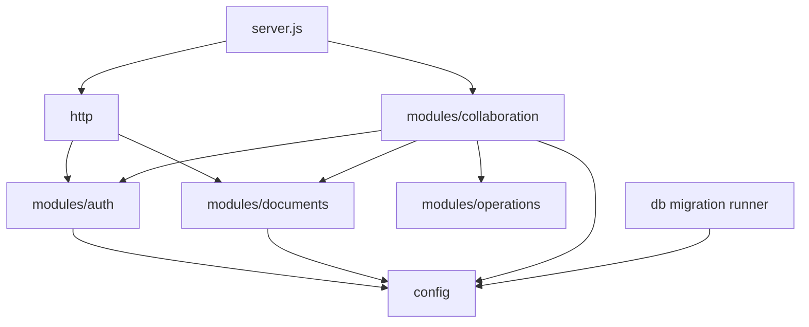

# Backend Source Map

`backend/src` contains the executable backend layers. Dependencies point inward from transport code to domain repositories and shared configuration; the operational-transform engine remains independent of infrastructure.

## Folders

| Folder | Responsibility | Primary consumers |
| --- | --- | --- |
| [`config/`](config/README.md) | Environment parsing, PostgreSQL pool, lazy Redis client | All data-backed modules, health checks, startup |
| [`db/`](db/README.md) | Migration discovery, checksum validation, schema DDL | CLI migration command, database-backed tests |
| [`http/`](http/README.md) | Express middleware, health routes, `/api` gateway, final errors | `server.js`, HTTP tests |
| [`modules/auth/`](modules/auth/README.md) | Credentials, users, JWTs, bearer middleware | HTTP auth routes, document routes, WebSocket auth |
| [`modules/documents/`](modules/documents/README.md) | Document CRUD, permissions, sharing, statistics, durable state writes | HTTP gateway, collaboration server |
| [`modules/collaboration/`](modules/collaboration/README.md) | WebSocket protocol, rooms, cache, orchestration | `server.js`, frontend collaboration client |
| [`modules/operations/`](modules/operations/README.md) | Pure in-memory OT and revision history | Room manager |
| [`queue/`](queue/README.md) | Documents the absence of an external worker/queue | Architecture reference only |

## Dependency direction

The document repository is the only module that writes application document rows. Collaboration uses it through `findDocumentForUser` for authorization and `writeDocumentState` through the persistence coordinator.

## Shared conventions

- CommonJS exports are explicit at the end of each backend module.
- SQL is parameterized; dynamic assignment fragments are built only from known field names.
- Multi-table updates use transactions and always release clients in `finally`.
- Validation errors carry structured details; domain errors carry stable classes or protocol codes.
- Infrastructure dependencies are injectable in cache, persistence, and WebSocket orchestration to support isolated tests.

There is no general `utils` or `middleware` folder. Reusable helpers remain beside their domain: bearer middleware in auth, validation within each domain, and protocol parsing in collaboration.

Related: [backend guide](../README.md), [full workflow](../../WORKFLOW.md), [architecture metrics](../../METRICS.md).
