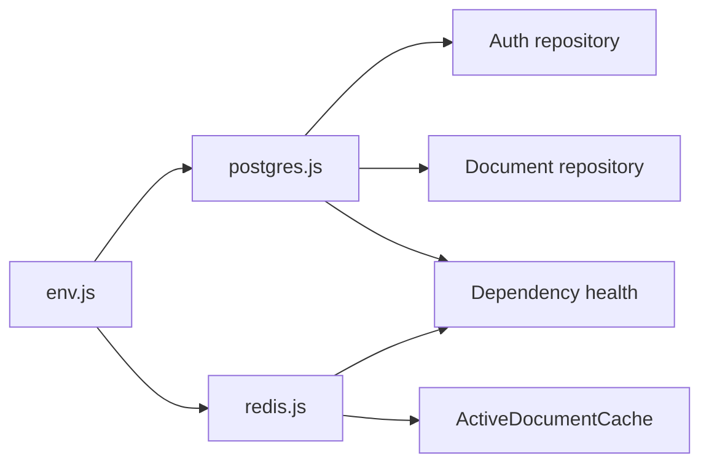

# Backend Configuration

This folder centralizes environment parsing and the two shared data-service clients.

## Files and exports

| File | Exports | Responsibility |
| --- | --- | --- |
| `env.js` | `env` | Loads `.env`, applies defaults, validates positive integer settings, and enforces a production JWT secret |
| `postgres.js` | `pool`, `checkPostgres`, `closePostgresPool` | Creates the process-wide `pg.Pool`, exposes a health probe, and closes it |
| `redis.js` | `getRedisClient`, `connectRedis`, `checkRedis`, `closeRedisClient` | Lazily creates/connects the Redis singleton, shares concurrent connection attempts, probes, and closes it |

## Environment settings

| Setting | Consumer |
| --- | --- |
| `PORT`, `CORS_ORIGIN`, `NODE_ENV` | HTTP startup and middleware |
| `DATABASE_URL` | PostgreSQL pool |
| `REDIS_URL` | Redis client |
| `ACTIVE_DOCUMENT_CACHE_TTL_SECONDS` | Active-document cache |
| `DOCUMENT_PERSIST_DEBOUNCE_MS`, `DOCUMENT_PERSIST_RETRY_MS` | Persistence coordinator |
| `JWT_SECRET`, `JWT_EXPIRES_IN_SECONDS` | Token signing and session responses |

Invalid positive-integer values fall back to defaults; they do not abort startup. An absent `JWT_SECRET` uses a development-only value unless `NODE_ENV=production`, in which case module loading throws.

## Failure and lifecycle behavior

- PostgreSQL connection/query errors propagate to the caller. Health checks catch them in the HTTP layer.
- The Redis client logs emitted errors. `connectRedis()` resets its shared Promise after success or failure so a later call can retry.
- Shutdown closes Redis only when open and always ends the PostgreSQL pool.

## Interactions

Related: [backend source map](../README.md), [database layer](../db/README.md), [collaboration cache](../modules/collaboration/README.md), [root environment guide](../../../README.md#running-locally).
