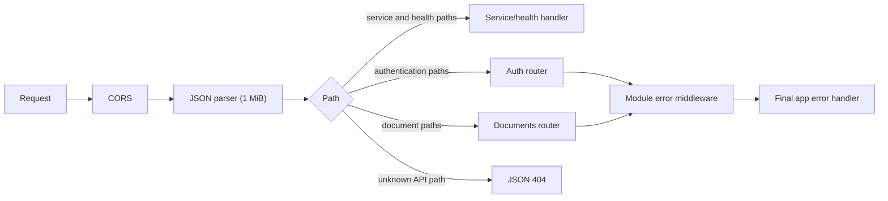

# HTTP Layer

The HTTP layer composes Express middleware and routes. It contains no business persistence logic.

## Files

| File | Export | Responsibility |
| --- | --- | --- |
| `app.js` | `createApp` | CORS, JSON parsing, service/health routes, API mounting, final errors |
| `apiGateway.js` | `createApiGateway` | `/api` route index, auth/document router mounting, API 404 |

## Request pipeline

`/health/dependencies` probes PostgreSQL and Redis concurrently and returns 503 with per-dependency messages when either is unavailable. `/health` is process-only and does not contact dependencies.

## Error behavior

Auth and document routers translate known validation/domain errors. Unexpected errors reach `handleError`, which uses an explicit `statusCode` only when it is an integer of at least 400. Server errors return a generic message; expected client errors may return their message.

Async route handlers are wrapped locally so rejected Promises reach Express error middleware. The two modules use equivalent private wrappers rather than a shared utility.

## Boundary with WebSockets

The API gateway does not route `/ws`. The collaboration server registers an `upgrade` listener directly on the Node HTTP server and authenticates messages after the WebSocket opens.

Related: [auth](../modules/auth/README.md), [documents](../modules/documents/README.md), [collaboration](../modules/collaboration/README.md), [API overview](../../../README.md#api-overview).
