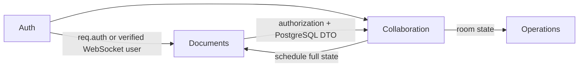

# Backend Modules

The modules folder contains the application's domain and realtime behavior.

## Modules

| Module | Owns | Depends on |
| --- | --- | --- |
| [`auth/`](auth/README.md) | Accounts, password hashing, JWTs, bearer middleware, auth validation/routes | PostgreSQL, environment, Node crypto |
| [`documents/`](documents/README.md) | Document lifecycle, roles, sharing, statistics, durable collaborative writes | PostgreSQL, auth middleware |
| [`collaboration/`](collaboration/README.md) | WebSocket protocol/server, room membership/presence, active Redis state | Auth, documents, operations, Redis |
| [`operations/`](operations/README.md) | Revision state, splice transformation/application, bounded idempotency | No infrastructure |

## Interaction map

There is no shared module registry or dependency injection container. Express constructs routers directly, while the collaboration server accepts optional dependencies for tests and controlled substitution.

Validation stays at transport boundaries: auth/document HTTP bodies have dedicated validation modules, and WebSocket frames use collaboration protocol validation. OT validates revision and range invariants again before mutating room state.

Related: [backend source map](../README.md), [HTTP layer](../http/README.md), [engineering workflow](../../../WORKFLOW.md).
