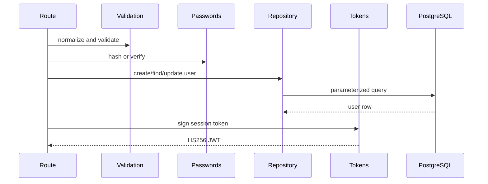

# Authentication Module

This module owns account persistence, credential verification, session-token creation/validation, HTTP auth routes, and bearer middleware.

## Files and exports

| File | Main exports | Responsibility |
| --- | --- | --- |
| `routes.js` | `createAuthRouter` | Registration, login, session/user reads, password-confirmed profile updates |
| `middleware.js` | `requireAuth`, `extractBearerToken` | Bearer extraction, token verification, active-user reload, `req.auth` |
| `passwords.js` | `hashPassword`, `verifyPassword` | Salted `scrypt` storage format and safe comparison |
| `tokens.js` | `signSessionToken`, `verifySessionToken`, `AuthTokenError`, `TOKEN_TYPE` | Minimal HS256 JWT implementation |
| `repository.js` | user CRUD lookup/update functions, `DuplicateEmailError` | Parameterized `users` queries and DTO mapping |
| `validation.js` | request parsers, `ValidationError` | Normalization and field validation |

## Public HTTP APIs

| Method/path | Input | Output |
| --- | --- | --- |
| `POST /api/auth/register` | email, display name, password | token metadata and user |
| `POST /api/auth/login` | email, password | token metadata and user |
| `GET /api/auth/session` | bearer token | authenticated flag and current user |
| `GET /api/auth/me` | bearer token | current user |
| `PATCH /api/auth/me` | current password plus changed profile fields | updated user |

## Internal workflow

Passwords are encoded as `scrypt$N$r$p$salt$key` with a random salt. The verifier parses and validates parameters before deriving a key and using `timingSafeEqual`.

JWTs include `sub`, account claims, `iat`, and `exp`. Verification checks structure, header algorithm/type, HMAC signature, expiry, and subject. Protected requests then load the active user; they do not trust token account claims as current data.

## Failure handling

- Body errors: 400 with field details.
- Invalid credentials, token, missing user, or wrong current password: 401.
- Active email uniqueness conflict: 409.
- Unexpected repository/crypto errors: forwarded to the application error handler.

## Performance and security notes

`scrypt` intentionally consumes CPU/memory; authentication throughput should be capacity-tested before public deployment. JWT state is not stored server-side, so there is no token revocation list. The production environment must provide `JWT_SECRET`.

## Related modules

- [HTTP routing](../../http/README.md)
- [Documents and permission middleware use](../documents/README.md)
- [WebSocket authentication](../collaboration/README.md)
- [Database schema](../../db/README.md)
- [Configuration](../../config/README.md)
