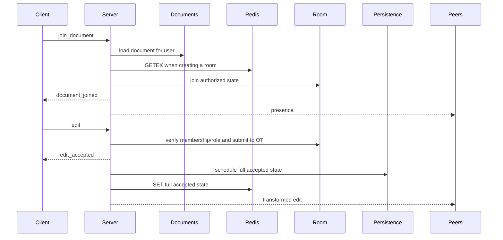

# Collaboration Module

This module owns the `/ws` protocol, permission-aware document rooms, presence, edit orchestration, Redis active state, and the bridge to PostgreSQL persistence.

## Files and exports

| File | Main exports | Responsibility |
| --- | --- | --- |
| `server.js` | `attachCollaborationServer` | Upgrade handling, connection lifecycle, message routing, auth, joins, edits, cache/persistence coordination |
| `protocol.js` | `parseClientMessage`, `CollaborationProtocolError` | JSON frame validation and normalized client messages |
| `roomManager.js` | `RoomManager` | Client memberships, room OT state, presence counts, broadcasts, inactive-room removal |
| `activeDocumentCache.js` | `ActiveDocumentCache`, `activeDocumentCache` | Versioned Redis JSON reads/writes/deletes with sliding TTL |
| `server.test.js` | executable test | WebSocket lifecycle, concurrent edits, roles, presence, cache/recovery/flush |
| `activeDocumentCache.test.js` | executable test | Cache validation, TTL options, malformed records, deletion |

## Connection lifecycle

The collaboration server attaches to an existing Node HTTP server in `noServer` mode. It accepts only `/ws`, limits frames to 64 KiB, sends an initial `connected` event, and requires authentication within 10 seconds. A 30-second ping/pong heartbeat terminates nonresponsive connections.

Each client record contains its socket, authenticated user, room map, liveness flag, authentication timer, and a Promise message chain. Frames from one client are processed serially even when handlers await PostgreSQL or Redis.

## Client messages

```json
{ "type": "authenticate", "token": "<jwt>" }
{ "type": "join_document", "documentId": "<uuid>" }
{ "type": "leave_document", "documentId": "<uuid>" }
{
  "type": "edit",
  "documentId": "<uuid>",
  "clientOperationId": "<unique-per-user-id>",
  "baseRevision": 4,
  "operation": { "index": 12, "deleteCount": 3, "insertText": "new" }
}
```

Binary data, malformed JSON, unknown types, invalid UUIDs/revisions/ranges, no-op edits, inserts above 50,000 characters, and operation IDs above 128 characters are rejected before room mutation.

## Server messages

| Type | Purpose |
| --- | --- |
| `connected` | Announces that token authentication is required |
| `authenticated` | Returns the public active user |
| `document_joined` | Authoritative content, revision, role, and participant count |
| `document_left` | Confirms room departure |
| `presence` | Current socket membership count for the room |
| `edit_accepted` | Acknowledges the transformed operation and next revision to its sender |
| `edit` | Broadcasts the transformed operation, next revision, and author to peers |
| `error` | Stable code/message plus optional document and current revision |

## Room and edit flow



Owners and editors may publish. Viewers can join and receive content, presence, and edits but receive `EDIT_FORBIDDEN` if they publish.

Duplicate operation delivery receives the original acknowledgement without another cache write, persistence schedule, or broadcast.

## Active document cache

The key is `collab:active-document:<documentId>`. Schema version 2 stores document ID, full content, revision, last editor, and cache timestamp.

When creating a room, PostgreSQL first proves access and supplies the durable revision. A valid Redis record is accepted only when its revision is at least that database revision. Older/missing/invalid cache data is replaced with database state. Ahead or equal-revision divergent cache data is used and synchronized back to PostgreSQL.

`GETEX` refreshes the TTL, while every accepted edit performs `SET` with the TTL. Invalid records are deleted. Redis exceptions are logged and do not prevent database/in-memory collaboration.

## Room cleanup and persistence

Leaving/disconnecting removes client membership and broadcasts presence. The final departure deletes the in-memory room and requests an immediate persistence flush. Collaboration shutdown terminates sockets and closes the persistence coordinator, which drains all pending documents.

The room's OT history is not copied to Redis or PostgreSQL. Only full content, revision, and last-editor state cross those boundaries.

## Scalability considerations

Rooms and broadcasts are local to one process. Broadcast cost is linear in connected room members. Cache writes serialize the full document for each accepted edit. Multi-instance deployment requires document routing and shared realtime coordination; Redis is currently used as a key/value cache, not pub/sub.

## Related modules

- [Authentication](../auth/README.md)
- [Documents and persistence](../documents/README.md)
- [Operational transform](../operations/README.md)
- [Redis/PostgreSQL configuration](../../config/README.md)
- [Frontend WebSocket client](../../../../frontend/src/collaboration/README.md)
- [Detailed workflow](../../../../WORKFLOW.md#realtime-connection-workflow)
