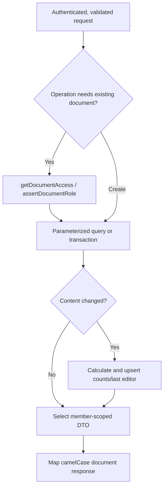

# Documents Module

This module owns document lifecycle, access roles, sharing, derived statistics, and the PostgreSQL destination for accepted collaboration state.

## Files and exports

| File | Main exports | Responsibility |
| --- | --- | --- |
| `routes.js` | `createDocumentsRouter` | Authenticated REST routes and document error mapping |
| `validation.js` | request parsers, `DocumentValidationError` | UUID, body, metadata, content, role, email, and share-code validation |
| `repository.js` | CRUD/sharing/state functions and domain error classes | Transactions, access checks, DTO mapping, statistics, revision-aware writes |
| `statePersistence.js` | `DocumentStatePersistence` | Per-document debounce, coalescing, retry, explicit flush, shutdown drain |
| `crud.test.js` | executable test | HTTP CRUD, versions/statistics, persistence guard, archive visibility |
| `access.test.js` | executable test | invitations, codes, roles, member visibility, profile verification |
| `statePersistence.test.js` | executable test | coalescing, independent flush, retry, shutdown behavior |

## Public HTTP APIs

All routes are below `/api/documents` and use `requireAuth`.

| Method/path | Role | Repository operation |
| --- | --- | --- |
| `GET /` | Any member | `listDocumentsForUser` |
| `POST /` | Authenticated user | `createDocument` |
| `POST /join` | Authenticated user | `joinSharedDocument` |
| `GET /:documentId` | Any member | `findDocumentForUser` |
| `GET /:documentId/members` | Owner | `listDocumentMembers` |
| `POST /:documentId/share` | Owner | `shareDocumentWithUser` |
| `POST /:documentId/share-link` | Owner | `createDocumentShareLink` |
| `PATCH /:documentId` | Owner/editor | `updateDocument` |
| `PUT /:documentId/save` | Owner/editor | `saveDocument` |
| `DELETE /:documentId` | Owner | `deleteDocument` |

## Repository workflow

`createDocument` atomically inserts the document, owner permission, and initial statistics. `updateDocument` constructs assignments only for supplied fields and increments the version only when content changes. `deleteDocument` soft archives and increments the version.

Document DTOs include permission role and text statistics. The private `shareLink` field is removed from returned metadata.

## Sharing

Direct invitation looks up an active user by normalized email and upserts an editor/viewer permission without replacing owners. Share-code creation stores a new random 12-hex-character code and role in document JSON metadata. Joining locks the matching active document, grants the stored role to non-owners, and returns the member-scoped document.

Codes do not have an expiry column. The user-facing not-found message says a code may have expired, while the implemented invalidation mechanism is replacement by a newly generated code or document archival.

## Realtime persistence

The collaboration server schedules full accepted states through `DocumentStatePersistence`:

1. normalize the state and ignore an older revision;
2. retain only the latest pending state for that document;
3. start one debounce timer when no flush is active;
4. drain pending states serially, including a newer state that arrives mid-write;
5. restore failed state and schedule retry;
6. remove the record after a successful empty drain.

`writeDocumentState` locks the document row in a transaction. It returns `stale` instead of overwriting a newer stored revision, returns `unchanged` for an identical state, or updates content/version/statistics atomically.

Inactive rooms and collaboration shutdown call explicit flush methods. This scheduler is in process; it is not a durable job queue.

## Failure handling

- Invalid request data becomes 400 with field details.
- Missing, archived, or inaccessible documents become 404.
- A known member without the required role receives 403.
- Sharing lookup/conflict errors carry their own 400/404 status.
- All repository transactions roll back on failure and release clients in `finally`.
- Persistence warnings are logged by the caller; failed states remain pending for retry.

## Performance and scalability

Permission queries use the composite permission primary key and user index. Lists use document recency indexes. Coalesced realtime writes reduce PostgreSQL traffic, while a row lock and revision comparison serialize durable document state. Full document content is rewritten per flushed revision, so persistence cost grows with document size.

## Related modules

- [Authentication](../auth/README.md)
- [Collaboration orchestration](../collaboration/README.md)
- [Operational transform](../operations/README.md)
- [Database schema](../../db/README.md)
- [HTTP layer](../../http/README.md)
- [Consistency workflow](../../../../WORKFLOW.md#consistency-and-recovery-model)
