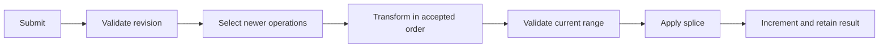

# Operations Module

This module is the infrastructure-independent operational-transform engine for an active document room.

## Files and exports

| File | Exports | Responsibility |
| --- | --- | --- |
| `operationalTransform.js` | `DocumentOperationState`, `OperationError`, `applyOperation`, `transformOperation` | Revision state, validation, transformation, application, bounded history/idempotency |
| `operationalTransform.test.js` | executable test | Splice application, transform rules, concurrency, duplicates, invalid revisions/ranges, history bounds |

## Operation model

Every edit is one JavaScript string splice:

```js
{ index, deleteCount, insertText }
```

`index` and `deleteCount` are UTF-16 code-unit positions. A client also supplies the revision on which it created the splice. The room processes submissions in server arrival order.

## Submission algorithm

1. Use `userId:clientOperationId` as an idempotency key.
2. Return the previous result for the exact same submission; reject a changed reuse.
3. Require a non-negative retained base revision that is not ahead of the room.
4. Gather history entries newer than the base revision.
5. Reverse their length deltas to validate the splice against historical content length.
6. Transform the splice through each newer accepted operation.
7. Validate against current content, apply, and increment the revision.
8. Store accepted history/idempotency data and trim beyond 1,000 entries.



## Conflict behavior

- Concurrent inserts at one position are ordered by server acceptance; the later operation moves right.
- Positions before a change are stable; positions after it shift by inserted length minus deleted length.
- Positions inside a deleted range collapse to its start, with affinity determining whether replacement text lies before or after the transformed endpoint.
- A delete transforms both endpoints and keeps only the resulting live span.

## Errors

| Code | Meaning |
| --- | --- |
| `INVALID_REVISION` | Base revision is not a non-negative integer |
| `REVISION_AHEAD` | Client claims a future state |
| `REVISION_TOO_OLD` | Required transform history was trimmed |
| `OPERATION_OUT_OF_BOUNDS` | Splice cannot fit the relevant content |
| `OPERATION_ID_REUSED` | Accepted ID was reused for different input |

Each `OperationError` carries the current room revision so protocol errors can guide resynchronization.

## State lifecycle and performance

One `DocumentOperationState` exists per active room. History and idempotency records are bounded together to 1,000 entries. Transform cost is linear in accepted operations since the base revision, and apply cost copies the document string. When the room becomes inactive, history is discarded; full content and revision remain recoverable from Redis/PostgreSQL.

## Related modules

- [Room manager and WebSocket orchestration](../collaboration/README.md)
- [Durable document state](../documents/README.md#realtime-persistence)
- [Frontend synchronization](../../../../frontend/src/README.md#realtime-state)
- [Detailed OT workflow](../../../../WORKFLOW.md#operational-transform)
