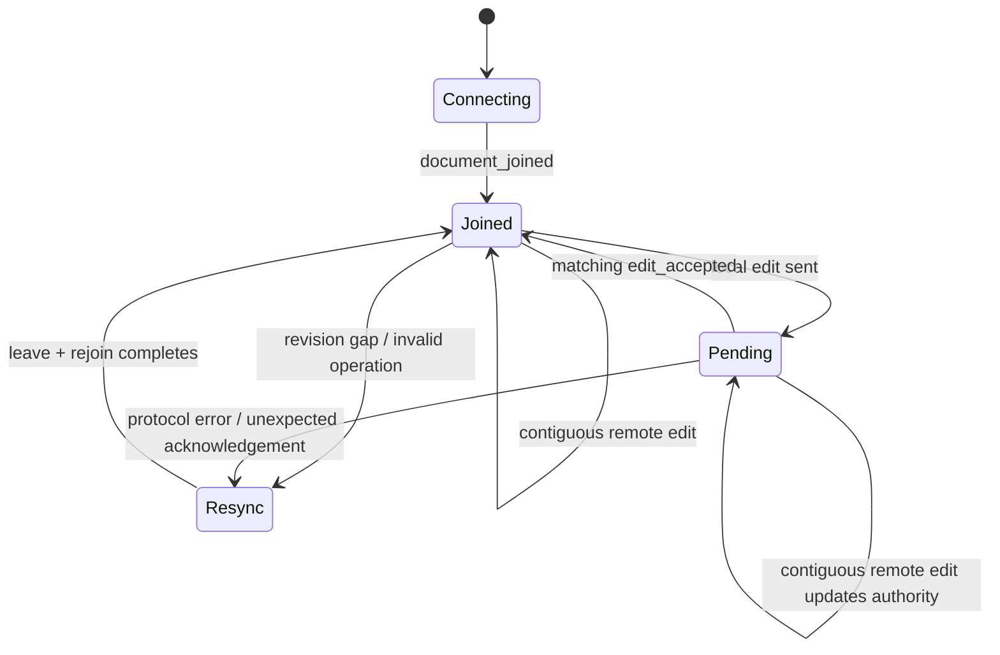

# Frontend Source Map

The frontend source is deliberately compact. Screens and UI components live in `App.tsx`; transport-specific code is separated into HTTP and WebSocket modules.

## Files

| File | Responsibility | Interactions |
| --- | --- | --- |
| `main.tsx` | Mounts `App` under React Strict Mode and loads global styles | Browser `#root`, `App.tsx`, `index.css` |
| `App.tsx` | Session/theme bootstrap, auth/workspace screens, document/dialog state, rich editor, live synchronization, utilities | `api.ts`, collaboration client, DOM/storage APIs |
| `api.ts` | Shared API models, `ApiError`, generic `apiRequest` | Browser Fetch, backend HTTP API |
| `collaboration/client.ts` | Typed WebSocket client and protocol union | Browser WebSocket, backend `/ws` |
| `index.css` | Theme variables, base typography, focus, selection, scrollbar styles | Applied globally |
| `App.css` | Auth/workspace/editor/dialog layout, states, animation, responsive rules | Class names rendered by `App.tsx` |

There are no separate `components`, `hooks`, `pages`, `context`, or state-store folders. The local component boundaries are functions within `App.tsx`, and React state/refs are the state-management mechanism.

## Component responsibilities

| Component/function | Responsibility |
| --- | --- |
| `App` | Theme persistence, token restoration/session validation, top-level screen selection |
| `Workspace` | Document list/selection, HTTP actions, WebSocket lifecycle, editor refs/state, dialogs |
| `handleCollaborationMessage` | Authoritative join/presence/edit/ack/error state transitions |
| `FormattingToolbar` / `FormatButton` | Browser formatting commands while preserving selection |
| `ShareDocumentDialog` | Member loading, email invitation, share-code generation/copy |
| `JoinDocumentDialog` | Share-code redemption |
| `AccountDialog` | Password-confirmed account changes and sign-out |
| `AuthScreen` | Registration/login form |
| `Modal`, loading/empty/theme helpers | Shared presentation primitives |

## HTTP state

Document list/create/read-derived updates, title changes, sharing, join, archive, account, and auth actions use `apiRequest`. The session token is stored in `localStorage` and verified through `/api/auth/session` on reload. A 401 while loading documents signs the user out.

## Realtime state

`Workspace` holds rendered editor state in React and asynchronous protocol invariants in refs:

| Ref/state | Meaning |
| --- | --- |
| `activeDocumentIdRef` | Currently selected document |
| `requestedDocumentIdRef` | Room join requested/active on the socket |
| `authoritativeContentRef` | Content after all contiguous server operations |
| `revisionRef` | Latest contiguous server revision |
| `pendingOperationIdRef` | The one optimistic local operation awaiting acknowledgement |
| `editor` state | Rendered content, role, presence, revision, pending/error/join flags |

The visible optimistic content is retained while a local operation is pending; incoming server operations update the authoritative reference. After the pending acknowledgement clears, rendered content returns to the authoritative sequence.

## Rich-text processing

`createEditOperation` compares prior/next serialized HTML, finds their shared prefix/suffix, and emits one replacement. `sanitizeRichText` unwraps unsupported tags, removes attributes, and preserves only left/center/right/justify alignment. Text metrics use a temporary DOM element to extract rendered text.

Because collaboration operates on serialized HTML and JavaScript string positions, all clients must use the server-returned transformed splice and revision rather than independently interpreting document structure.

## Styling and accessibility

Theme colors are CSS custom properties selected with `data-theme`. Layout switches from a desktop sidebar to horizontal mobile navigation and stacks controls at narrow widths. Focus-visible outlines, labels, dialog roles, live status regions, disabled states, and reduced-motion rules are implemented in the existing markup/styles.

## Related documentation

- [Frontend guide](../README.md)
- [WebSocket client module](collaboration/README.md)
- [Backend API](../../README.md#api-overview)
- [Collaboration server](../../backend/src/modules/collaboration/README.md)
- [Detailed frontend workflow](../../WORKFLOW.md#frontend-state-and-editor-synchronization)
